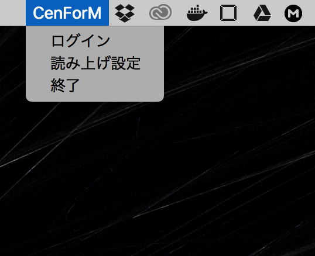
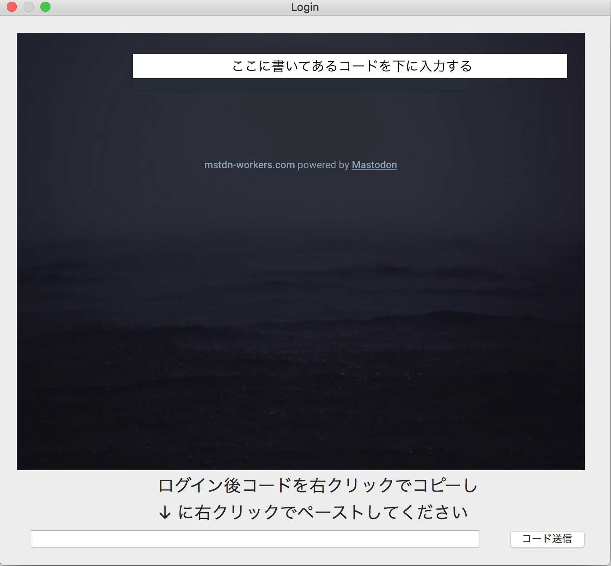

# CenozoicForMac

作業はしてたいけど[(労働者のための)マストドン](https://mstdn-workers.com/about)の内容は覗いていたい...そんな社畜におすすめのMac用クライアント(予定)です。  
Mac上で動作するステータスバーアプリ(Dockに表示されないアプリ)です。

### Installation
---
#### .appをインストールする

CenozoicForMac.appをこちらからダウンロードして、ダブルクリックなどで起動するとプログラムが動きます。

#### ソースからインストールする

現在このアプリをビルドするためにはXcodeが必要です。また、筆者の環境では8.3.3ですが、8.3以上なら動くはずです。  
まずは任意のターミナルを使って次のようにコマンドを打つか、githubの右上にある
"Clone or download"、またこちらのページからzip(またはtar.gz)をダウンロードして、任意の解凍ソフトで解凍ししてください。

``` shell
$ git clone https://github.com/sa2taka/CenozoicForMac
```

次にXcodeでダウンロードしたファイルの中の"CenozoicForMac.xcodeproj"を開き、Cmd-rもしくはXcode左上の三角ボタン、またはファイルメニューのProduct->Runより実行してください。  

### Usage
---

#### as Reader

現在のバージョン(v1.0)ではコマンドキーを二回タップすることで読み上げが開始されます。読み上げを停止したい場合もコマンドキーを二回タップしてください。  
また起動するとステータスバーに"CenForM"という名前が表示されます。そこをクリックすると次のようなメニューが表示されます。  
読み上げ設定画面を押すと読み上げスピードや、省略最大文字数を設定出来ます。
また終了ボタンを押すとアプリを終了します。



#### Login

メニュー画面からログインボタンを押すとログイン画面が表示されます。  
ログインし、承認ボタンを押した後、コードをコピー・アンド・ペーストで貼り付け送信することでこのアプリが承認されtootが出来るようになります。



#### as Tooter

toot画面を表示するためにはCmd-Ctrl-tを押します。  
この時文字列は入力できますが、改行が現在出来ません(Ctrl-Enterで見た目だけ改行は出来ますが)。  
そしてCmd-Enterで送信します


### 以下備忘録兼実装したいものリスト
---

- [x] ログイン機構  
- [x] Toot機能
- [ ] tootの改行機能
- [ ] ログインアカウントのLTLの読み上げ
- [ ] ([KeyHolder](https://github.com/Clipy/KeyHolder)を用いた)ショートカットの任意変更機能  
- [ ] (簡易的な)単語の読み方変更機能
- [ ] このアプリのアイコン(ステータスバーに表示する)を作りたい
- [ ] 様々な丼への対応

### Other
---
何かあれば [mstdn@mstdn-workers.com@t0p_l1ght](https://mstdn-workers.com/@t0p_l1ght) まで
